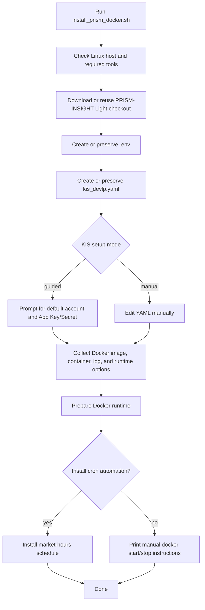

# PRISM-INSIGHT Light Guide

PRISM-INSIGHT Light is a lightweight fork of the original **PRISM-INSIGHT** project that keeps only the trading execution runtime.

```text
GCP Pub/Sub -> signal validation -> Korea Investment & Securities (KIS) Korean/US stock orders
```

> Automated trading can lose money. Start with `demo` mode and `--dry-run` before using real accounts.

## Respect the original creator

This repository is based on the original PRISM-INSIGHT project by **dragon1086**.

- Original project: <https://github.com/dragon1086/prism-insight>
- Sponsor the original creator: <https://github.com/sponsors/dragon1086>

If this lightweight version helps you, please also visit the original project and consider sponsoring the original creator.

## Purpose of this fork

This fork removes analysis, reporting, and broad integration features so the remaining code is easier to run and understand.

It focuses on:

- receiving Pub/Sub messages and validating them as trading signals;
- routing Korean and US stock orders through the KIS API;
- checking market hours and off-hours policy;
- queueing demo trades outside market hours;
- running with Docker and optional cron automation;
- optionally fetching signal-like posts from a public Telegram channel.

## Main files

| Path | Purpose |
| --- | --- |
| `subscriber.py` | Main Pub/Sub subscriber entrypoint |
| `trading/` | KIS auth, Korean/US order routing, signal validation, market-hours logic, off-hours policy |
| `trading/config/kis_devlp.yaml.example` | Example KIS configuration |
| `check_pubsub_readiness.py` | Pub/Sub configuration readiness check |
| `install_prism_docker.sh` | Linux one-click Docker installer |
| `setup_subscriber_docker_crontab.sh` | Docker container and cron automation helper |
| `tests/` | Regression tests for the remaining runtime |

## Removed scope

This lightweight fork does not include:

- analysis/orchestration/report generation;
- the legacy Telegram delivery pipeline, Firebase, Redis, dashboards, or mobile integrations;
- trigger screening and publisher flows;
- non-trading documentation, examples, and tests.

## Quick start

### 1. Install Python dependencies

```bash
pip install -r requirements.txt
```

### 2. Configure environment variables

Copy `.env.example` to `.env`, then fill in the values.

```bash
GCP_PROJECT_ID=your-project-id
GCP_PUBSUB_SUBSCRIPTION_ID=your-subscription-id
GCP_CREDENTIALS_PATH=/absolute/path/to/service-account.json
TELEGRAM_SIGNAL_CHANNEL_URL=https://t.me/prism_insight_global_en
TELEGRAM_FETCH_PAGES=3
KIS_RATE_LIMIT_RETRY_ATTEMPTS=10
KIS_RATE_LIMIT_RETRY_BASE_SECONDS=1.0
KIS_RATE_LIMIT_RETRY_MAX_SECONDS=5.0
```

The required Pub/Sub values are:

- `GCP_PROJECT_ID`
- `GCP_PUBSUB_SUBSCRIPTION_ID`
- `GCP_CREDENTIALS_PATH`

### 3. Configure KIS

Copy the example KIS config to the live config path.

```bash
cp trading/config/kis_devlp.yaml.example trading/config/kis_devlp.yaml
```

Recommended first-run flow:

1. keep `default_mode: demo`;
2. enter a paper-trading account and paper App Key/Secret;
3. confirm `auto_trading` and account settings;
4. run with `--dry-run`;
5. only then configure real accounts if needed.


### Optional USD auto-exchange for US buys

US stock buy sizes are configured in USD. By default the bot only uses existing USD buying power. If you want KIS to use KRW-to-USD exchange buying power for US stock buys, enable it explicitly in `trading/config/kis_devlp.yaml`:

```yaml
auto_exchange_usd_on_buy: true
max_auto_exchange_krw: 500000   # optional per-order KRW cap
```

The implementation uses the KIS overseas stock buyable-amount inquiry field `echm_af_ord_psbl_amt` (amount orderable after exchange) and then submits the normal US stock order. Test with `default_mode: demo` or a small real order before relying on it.

## Pub/Sub readiness check

Run this from the repository root on the host/source tree:

```bash
python check_pubsub_readiness.py
```

Set `GCP_PROJECT_ID`, `GCP_PUBSUB_SUBSCRIPTION_ID`, and `GCP_CREDENTIALS_PATH` first.
The current Docker package does not include `check_pubsub_readiness.py`, so run it from the host checkout.

## Running the subscriber

### Dry run, no live orders

```bash
python subscriber.py --dry-run
```

### Live mode

```bash
python subscriber.py
```

Before live mode, verify your KIS accounts, App Key/Secret values, Pub/Sub subscription, and service-account permissions.

## Signal message contract

Inbound Pub/Sub messages may use these fields.

| Field | Meaning |
| --- | --- |
| `type` | `BUY`, `SELL`, or `EVENT` |
| `ticker` | Stock code or ticker |
| `company_name` | Company name |
| `market` | `KR` or `US` |
| `price` | Current/reference price |
| `target_price` | Target price |
| `stop_loss` | Stop-loss price |
| `buy_score` | Buy score |
| `rationale` | Signal rationale |
| `profit_rate` | Profit rate |
| `sell_reason` | Sell reason |
| `buy_price` | Buy price |
| `event_type` | Event category |
| `source` | Source URL |
| `event_description` | Event description |

Behavior:

- `BUY` / `SELL`
  - market open: execute;
  - market closed + demo mode: queue until the next market open;
  - market closed + real mode: reject and ack.
- `EVENT`: log and ack, with no trade.
- malformed or unsupported payload: log and ack.

## Telegram fetch helper

`trading.telegram_fetch` can fetch and parse signal-like posts from Telegram public preview pages.

- Default channel: `https://t.me/prism_insight_global_en`
- Fetch source format: `https://t.me/s/<channel>`
- Supported parsed post shapes:
  - JSON bodies matching the signal contract above;
  - labeled English text posts such as `New Buy`, `Sell`, and `Event`.

Example:

```python
from trading.telegram_fetch import fetch_signal_messages

signals = fetch_signal_messages(pages=3)
for item in signals:
    print(item.signal.signal_type, item.signal.ticker, item.signal.price)
```

Notes:

- The canonical validation target remains the JSON signal contract above.
- Telegram public previews may hide post history depending on the requesting environment.
- Live fetch results from the default channel may be empty when Telegram only exposes channel metadata.
- The Telegram post URL is treated as the canonical `source`; a message-provided `Source:` line is preserved only as additional content metadata.

## Docker usage

### Linux one-click installer

On a Linux host, download and run the installer with one command:

```bash
curl -fsSL https://raw.githubusercontent.com/tkgo11/prism-insight-light/main/install_prism_docker.sh | bash
```

By default, the installer downloads the current `main` branch archive.

Installer flow:



The installer can handle:

- project download;
- `.env` creation from `.env.example`;
- KIS config preparation from `trading/config/kis_devlp.yaml.example`;
- Docker image and container definition;
- optional crontab automation.

You still need to verify:

- the real GCP service-account JSON path;
- real KIS account numbers, App Keys, and App Secrets;
- whether the system timezone should be set to `Asia/Seoul`;
- whether cron automation should be installed.

Supported environment:

- Linux host only;
- requires `bash`, `tar`, `curl` or `wget`, and `docker`;
- cron automation may also require `crontab`, `timedatectl`, and `sudo`.

### KIS setup modes

The installer supports two KIS setup modes.

1. `guided`: quick setup for one default account and shared App Key/Secret values.
2. `manual`: advanced setup by editing `kis_devlp.yaml` directly. Recommended for multiple accounts.

If you edit `.env` or `kis_devlp.yaml` in an existing installation, rerun the installer to regenerate the container definition.

### Full Docker runtime uninstall

This removes cron, the container, the image, default runtime/log directories, and the install directory.

```bash
bash install_prism_docker.sh --install-dir /path/to/prism-insight-light --uninstall --non-interactive
```

### Remove only cron automation

This keeps the install directory and Docker runtime but removes cron entries.

```bash
bash install_prism_docker.sh --install-dir /path/to/prism-insight-light --uninstall-cron --non-interactive
```

### Manual Docker fallback

```bash
docker build -t pubsub-trader .
docker run --rm --env-file .env -v /absolute/path/to/kis_devlp.yaml:/app/trading/config/kis_devlp.yaml pubsub-trader
```

To run the container automatically only during market hours:

```bash
bash setup_subscriber_docker_crontab.sh
```

`setup_subscriber_docker_crontab.sh` creates the container once with the current settings, then uses `docker start` / `docker stop` on the market-hours schedule. If you change `.env`, rerun the script to regenerate the container definition.

## Verification

Run the full test suite:

```bash
pytest
```

Run focused runtime tests:

```bash
pytest tests/test_signal_schema.py tests/test_dispatch.py tests/test_market_hours.py tests/test_off_hours_policy.py tests/test_subscriber_smoke.py tests/test_multi_account_domestic.py tests/test_multi_account_kis_auth.py tests/test_multi_account_us.py tests/test_telegram_fetch.py
```

Run Docker installer smoke tests:

```bash
pytest tests/test_docker_installer_smoke.py
```

## Pre-flight checklist

- [ ] `.env` contains Pub/Sub values and Telegram settings.
- [ ] `trading/config/kis_devlp.yaml` contains KIS account and API credentials.
- [ ] You tested with `default_mode: demo` or `--dry-run` first.
- [ ] The Pub/Sub readiness check passed.
- [ ] You understand the off-hours policy and demo/real account separation.
- [ ] If using Docker/cron, you regenerated the container definition after `.env` changes.

## More links

- Korean guide: [README.ko.md](README.ko.md)
- Original project: <https://github.com/dragon1086/prism-insight>
- Sponsor the original creator: <https://github.com/sponsors/dragon1086>
