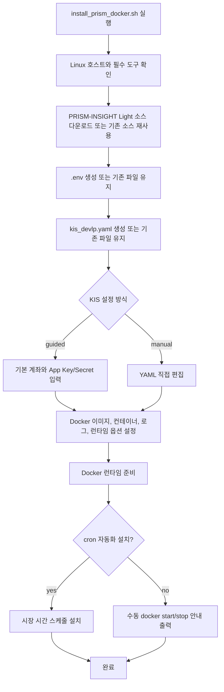

# PRISM-INSIGHT Light 사용 가이드

PRISM-INSIGHT Light는 원본 **PRISM-INSIGHT** 프로젝트에서 매매 실행에 필요한 최소 런타임만 분리한 경량 버전입니다.

```text
GCP Pub/Sub -> 신호 검증 -> 한국투자증권(KIS) 한국/미국 주식 주문
```

> 투자 및 자동매매에는 손실 위험이 있습니다. 먼저 모의투자(`demo`)와 `--dry-run`으로 충분히 확인한 뒤 사용하세요.

## 원 제작자 존중

이 저장소는 **dragon1086** 님의 원본 PRISM-INSIGHT 프로젝트를 기반으로 합니다.

- 원본 프로젝트: <https://github.com/dragon1086/prism-insight>
- 원 제작자 스폰서 링크: <https://github.com/sponsors/dragon1086>

이 경량 버전이 도움이 되었다면 원본 프로젝트도 확인해 주시고, 가능하다면 원 제작자를 후원해 주세요.

## 이 버전의 목표

원본 프로젝트의 분석, 리포트, 여러 외부 연동 기능을 제거하고 아래 기능에 집중합니다.

- Pub/Sub 메시지를 받아 매매 신호로 검증
- 한국투자증권(KIS) API로 한국/미국 주식 주문 라우팅
- 장 시간 확인 및 장외 정책 처리
- 모의투자 장외 대기열 처리
- Docker 기반 실행과 cron 자동화
- Telegram 공개 채널 게시글을 신호 형식으로 가져오는 보조 도구

## 남아 있는 주요 파일

| 경로 | 설명 |
| --- | --- |
| `subscriber.py` | Pub/Sub 메시지를 구독하고 매매 실행으로 연결하는 메인 진입점 |
| `trading/` | KIS 인증, 국내/미국 주문, 신호 검증, 라우팅, 장 시간, 장외 정책 |
| `trading/config/kis_devlp.yaml.example` | KIS 설정 예시 파일 |
| `check_pubsub_readiness.py` | Pub/Sub 설정 점검 스크립트 |
| `install_prism_docker.sh` | Linux용 Docker 원클릭 설치 스크립트 |
| `setup_subscriber_docker_crontab.sh` | Docker 컨테이너와 cron 자동화 설정 스크립트 |
| `tests/` | 현재 남아 있는 런타임 중심 회귀 테스트 |

## 제거된 범위

이 경량 버전에는 아래 기능이 포함되어 있지 않습니다.

- 분석/오케스트레이션/리포트 생성
- 기존 Telegram 발송 파이프라인, Firebase, Redis, 대시보드, 모바일 연동
- 트리거 선별 및 발행자 흐름
- 비매매 관련 문서, 예제, 테스트

## 빠른 시작

### 1. Python 패키지 설치

```bash
pip install -r requirements.txt
```

### 2. 환경 변수 설정

`.env.example`을 `.env`로 복사한 뒤 값을 채웁니다.

```bash
GCP_PROJECT_ID=your-project-id
GCP_PUBSUB_SUBSCRIPTION_ID=your-subscription-id
GCP_CREDENTIALS_PATH=/absolute/path/to/service-account.json
TELEGRAM_SIGNAL_CHANNEL_URL=https://t.me/prism_insight_global_en
TELEGRAM_FETCH_PAGES=3
KIS_RATE_LIMIT_RETRY_ATTEMPTS=10
KIS_RATE_LIMIT_RETRY_BASE_SECONDS=1.0
KIS_RATE_LIMIT_RETRY_MAX_SECONDS=5.0
```

필수 Pub/Sub 식별자는 다음 두 가지입니다.

- `GCP_PROJECT_ID`
- `GCP_PUBSUB_SUBSCRIPTION_ID`

호스트에 유효한 Google Application Default Credentials(ADC)가 이미 있다면 `GCP_CREDENTIALS_PATH`는 선택 사항입니다. 단, 원클릭 Docker 설치기는 자격증명을 컨테이너에 마운트하기 위해 명시적인 서비스 계정 파일을 요구합니다.

### 3. KIS 설정

예시 파일을 실제 설정 파일로 복사합니다.

```bash
cp trading/config/kis_devlp.yaml.example trading/config/kis_devlp.yaml
```

처음에는 안전하게 아래 흐름을 권장합니다.

1. `default_mode: demo` 유지
2. 모의투자 계좌와 모의투자 App Key/Secret 입력
3. `auto_trading` 값과 계좌 설정 확인
4. `--dry-run`으로 실행 확인
5. 충분히 검증한 뒤 실전 계좌 설정

## Pub/Sub 설정 점검

저장소 루트에서 실행합니다.

```bash
python check_pubsub_readiness.py
```

실행 전에 `GCP_PROJECT_ID`, `GCP_PUBSUB_SUBSCRIPTION_ID`를 설정하세요. 호스트에 유효한 ADC가 없다면 `GCP_CREDENTIALS_PATH`도 설정해야 합니다.
Docker 이미지에도 점검 스크립트가 포함됩니다. 기본 subscriber 명령을 덮어쓰고 설정한 서비스 계정 파일을 마운트해 실행할 수 있습니다.

```bash
docker run --rm --env-file .env \
  -e GCP_CREDENTIALS_PATH=/app/runtime/gcp-credentials.json \
  -v /absolute/path/to/service-account.json:/app/runtime/gcp-credentials.json:ro \
  pubsub-trader python check_pubsub_readiness.py
```

## 실행 방법

### 주문 없이 흐름만 확인

```bash
python subscriber.py --dry-run
```

### 실제 실행

```bash
python subscriber.py
```

실제 실행 전에는 KIS 계좌, App Key/Secret, Pub/Sub 구독, 서비스 계정 권한을 모두 확인하세요.

## 신호 메시지 형식

Pub/Sub 메시지는 아래 필드를 사용할 수 있습니다.

| 필드 | 설명 |
| --- | --- |
| `type` | `BUY`, `SELL`, `EVENT` |
| `ticker` | 종목 코드 또는 티커 |
| `company_name` | 종목명 |
| `market` | `KR` 또는 `US` |
| `price` | 현재가 또는 기준 가격 |
| `target_price` | 목표가 |
| `stop_loss` | 손절가 |
| `buy_score` | 매수 점수 |
| `rationale` | 신호 근거 |
| `profit_rate` | 수익률 |
| `sell_reason` | 매도 사유 |
| `buy_price` | 매수가 |
| `event_type` | 이벤트 종류 |
| `source` | 신호 출처 URL |
| `event_description` | 이벤트 설명 |

처리 방식은 다음과 같습니다.

- `BUY` / `SELL`
  - 장중: 주문 실행
  - 장외 + 모의투자: 다음 장 시작까지 대기열에 저장
  - 장외 + 실전투자: 거부 후 ack 처리
- `EVENT`: 로그 기록 후 ack 처리, 주문 없음
- 잘못된 메시지 또는 지원하지 않는 메시지: 로그 기록 후 ack 처리

## Telegram 신호 가져오기 보조 도구

`trading.telegram_fetch`는 Telegram 공개 미리보기 페이지에서 신호 후보를 가져오고 파싱하는 보조 모듈입니다.

- 기본 채널: `https://t.me/prism_insight_global_en`
- 가져오기 URL 형식: `https://t.me/s/<channel>`
- 지원 형식:
  - 위 신호 계약에 맞는 JSON 본문
  - `New Buy`, `Sell`, `Event` 같은 라벨 기반 영어 게시글

예시:

```python
from trading.telegram_fetch import fetch_signal_messages

signals = fetch_signal_messages(pages=3)
for item in signals:
    print(item.signal.signal_type, item.signal.ticker, item.signal.price)
```

주의할 점:

- 최종 검증 기준은 여전히 위 JSON 신호 계약입니다.
- Telegram 공개 미리보기는 요청 환경에 따라 게시글 목록을 보여 주지 않을 수 있습니다.
- 기본 채널에서 실시간 게시글이 보이지 않으면 결과가 비어 있을 수 있습니다.
- 게시글 안의 `Source:` 값은 보조 정보로 보관하고, 실제 출처는 Telegram 게시글 URL을 우선합니다.

## Docker로 실행하기

### Linux 원클릭 설치

Linux 호스트에서는 아래 명령으로 설치 스크립트를 내려받아 확인한 뒤 실행할 수 있습니다.

```bash
curl -fsSLO https://raw.githubusercontent.com/tkgo11/prism-insight-light/main/install_prism_docker.sh
less install_prism_docker.sh
bash install_prism_docker.sh
```

설치 스크립트는 기본적으로 현재 `main` 브랜치 기준 아카이브를 내려받습니다.

진행 흐름은 다음과 같습니다.



설치 스크립트가 자동으로 처리하는 항목:

- 프로젝트 다운로드
- `.env.example` 기반 `.env` 생성
- `trading/config/kis_devlp.yaml.example` 기반 KIS 설정 준비
- Docker 이미지와 컨테이너 정의 생성
- 선택 시 crontab 자동화 설치

사용자가 직접 확인해야 하는 항목:

- 실제 GCP 서비스 계정 JSON 경로
- 실제 KIS 계좌, App Key, App Secret
- 시스템 타임존을 `Asia/Seoul`로 변경할지 여부
- cron 자동 설치 여부

지원 범위:

- Linux 호스트 전용
- `bash`, `tar`, `curl` 또는 `wget`, `docker` 필요
- cron 자동화 사용 시 `crontab`, `timedatectl`, `sudo`가 필요할 수 있음

### KIS 설정 방식

설치 스크립트는 두 가지 KIS 설정 방식을 지원합니다.

1. `guided`: 단일 기본 계좌와 공통 App Key/Secret 중심의 빠른 설정
2. `manual`: `kis_devlp.yaml`을 직접 수정하는 고급 설정. 다중 계좌는 이 방식을 권장합니다.

이미 설치한 디렉토리에서 `.env` 또는 `kis_devlp.yaml`을 수정했다면 설치 스크립트를 다시 실행해 컨테이너 정의를 갱신할 수 있습니다.

### 전체 Docker 런타임 제거

cron, 컨테이너, 이미지, 기본 런타임/로그 디렉토리, 설치 디렉토리까지 제거합니다.

```bash
bash install_prism_docker.sh --install-dir /path/to/prism-insight-light --uninstall --non-interactive
```

### cron 스케줄만 제거

설치 디렉토리와 Docker 런타임은 유지하고 cron 스케줄만 제거합니다.

```bash
bash install_prism_docker.sh --install-dir /path/to/prism-insight-light --uninstall-cron --non-interactive
```

### 수동 Docker 실행

```bash
docker build -t pubsub-trader .
docker run --rm --env-file .env \
  -e GCP_CREDENTIALS_PATH=/app/runtime/gcp-credentials.json \
  -e PRISM_KIS_CONFIG_PATH=/app/trading/config/kis_devlp.yaml \
  -v /absolute/path/to/service-account.json:/app/runtime/gcp-credentials.json:ro \
  -v /absolute/path/to/kis_devlp.yaml:/app/trading/config/kis_devlp.yaml:ro \
  pubsub-trader
```

시장 시간에만 컨테이너를 자동으로 시작/중지하려면 다음 스크립트를 사용할 수 있습니다.

```bash
bash setup_subscriber_docker_crontab.sh
```

`setup_subscriber_docker_crontab.sh`는 설치 시 컨테이너를 현재 설정으로 한 번 생성하고, 이후에는 시장 시간에 맞춰 `docker start` / `docker stop --time -1`을 수행해 진행 중 주문을 강제 종료하지 않습니다. `.env`를 바꿨다면 스크립트를 다시 실행해 컨테이너 정의를 재생성하세요.


## 로컬 WebUI

WebUI는 Pub/Sub subscriber와 함께 실행할 수 있는 로컬 운영 콘솔이며 준비 상태, 신호 검증, 드라이런 시뮬레이션, Telegram 미리보기, 마스킹된 제한 로그, 오프아워 큐 읽기 전용 확인, 보호된 수동 BUY/SELL, 일부 운영 설정 편집을 제공합니다. 큐 변경, 브로커 로그인, 토큰 갱신, subscriber 제어 기능은 제공하지 않습니다.

수동 브로커 주문은 기본적으로 잠겨 있습니다. 안전한 배포는 기본 루프백 전용 바인딩을 사용하며, 각 주문에는 `WEBUI_ENABLE_LIVE_TRADING=true`, 화면에 표시된 확인 문구, 유효한 CSRF 토큰도 필요합니다. 신뢰할 수 있는 로컬 장비에서만 사용하세요. 명시적으로 허용한 비루프백 바인딩은 인증 수단이 아니며 실거래에는 권장하지 않습니다.

```bash
pip install -r requirements.txt
python subscriber.py --web-ui
```

고급 사용자는 `python -m webui` 직접 실행도 사용할 수 있습니다.

기본값은 로컬 전용입니다. 원격 노출은 별도 보안 검토 전까지 사용하지 마세요.

```env
WEBUI_HOST=127.0.0.1
WEBUI_PORT=8765
WEBUI_ALLOW_NON_LOOPBACK=false
WEBUI_ALLOWED_HOSTS=
WEBUI_ENABLE_LIVE_TRADING=false
# 내장 WebUI는 subscriber의 --dry-run 및 --queue-path 설정을 이어받습니다.
WEBUI_FORCE_DRY_RUN=false
WEBUI_QUEUE_PATH=runtime/off_hours_queue.json
# 비워 두면 프로세스 시작 때 새 토큰을 생성합니다.
WEBUI_CSRF_TOKEN=
```

브라우저에서 <http://127.0.0.1:8765> 를 여세요. Docker에서 실행할 경우 별도 승인 전에는 `127.0.0.1:8765:8765` 형태로 바인딩하세요.

## 검증

전체 테스트:

```bash
python -m pip install -r requirements-dev.txt
pytest
```

핵심 런타임 테스트만 실행하려면:

```bash
pytest tests/test_signal_schema.py tests/test_dispatch.py tests/test_market_hours.py tests/test_off_hours_policy.py tests/test_subscriber_smoke.py tests/test_multi_account_domestic.py tests/test_multi_account_kis_auth.py tests/test_multi_account_us.py tests/test_telegram_fetch.py
```

Docker 설치 스크립트 변경을 확인하려면:

```bash
pytest tests/test_docker_installer_smoke.py
```

## 운영 전 체크리스트

- [ ] `.env`에 Pub/Sub 값과 Telegram 설정을 입력했다.
- [ ] `trading/config/kis_devlp.yaml`에 KIS 계좌와 API 키를 입력했다.
- [ ] 먼저 `default_mode: demo` 또는 `--dry-run`으로 확인했다.
- [ ] Pub/Sub readiness check를 통과했다.
- [ ] 장외 정책과 모의/실전 계좌 구분을 이해했다.
- [ ] Docker/cron을 사용한다면 `.env` 변경 후 컨테이너 정의를 재생성했다.

## 더 읽기

- English guide: [README.en.md](README.en.md)
- 원본 프로젝트: <https://github.com/dragon1086/prism-insight>
- 원 제작자 스폰서: <https://github.com/sponsors/dragon1086>
