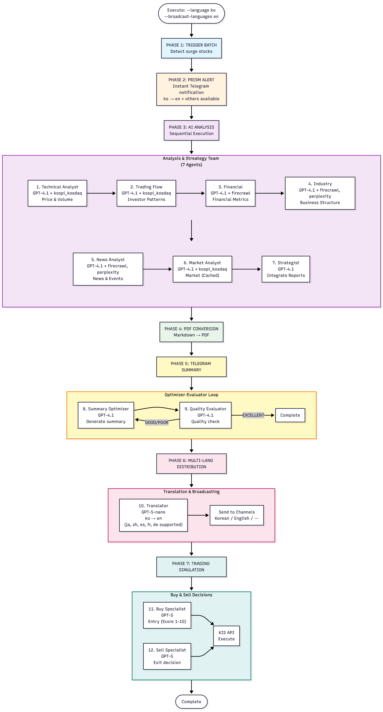
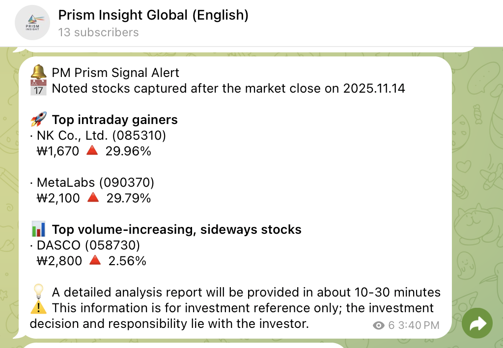
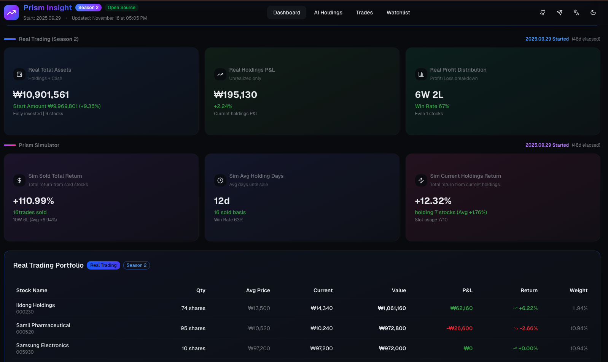

<div align="center">
  
  <br><br>
  
  
  
  
</div>

# PRISM-INSIGHT

[](https://github.com/sponsors/dragon1086)
[](https://github.com/dragon1086/prism-insight/stargazers)

> **AI-Powered Stock Market Analysis & Trading System**
>
> 13+ specialized AI agents collaborate to detect surge stocks, generate analyst-grade reports, and execute trades automatically.

📖 [한국어 문서](README_ko.md)

---

### 🏆 Platinum Sponsor

<div align="center">
<a href="https://wrks.ai/en">
  
</a>

**[AI3](https://www.ai3.kr/) | [WrksAI](https://wrks.ai/en)**

AI3, creator of **WrksAI** - the AI assistant for professionals,<br>
proudly sponsors **PRISM-INSIGHT** - the AI assistant for investors.
</div>

---

## ⚡ Try It Now (No Installation Required)

### 1. Live Dashboard
See AI trading performance in real-time:
👉 **[analysis.stocksimulation.kr](https://analysis.stocksimulation.kr/)**

### 2. Telegram Channels
Get daily surge stock alerts and AI analysis reports:
- 🇺🇸 **[English Channel](https://t.me/prism_insight_global_en)**
- 🇰🇷 **[Korean Channel](https://t.me/stock_ai_agent)**

### 3. Sample Report
Watch an AI-generated Apple Inc. analysis report:

[](https://youtu.be/LVOAdVCh1QE)

---

## ⚡ Try in 60 Seconds (US Stocks)

The fastest way to try PRISM-INSIGHT. Only requires an **OpenAI API key**.

```bash
# Clone and run the quickstart script
git clone https://github.com/dragon1086/prism-insight.git
cd prism-insight
./quickstart.sh YOUR_OPENAI_API_KEY
```

This generates an AI analysis report for Apple (AAPL). Try other stocks:
```bash
python3 demo.py MSFT              # Microsoft
python3 demo.py NVDA              # NVIDIA
python3 demo.py TSLA --language ko  # Tesla (Korean report)
```

> 💡 **Get your OpenAI API key** from [OpenAI Platform](https://platform.openai.com/api-keys)
>
> 📰 **Optional**: Add a [Perplexity API key](https://www.perplexity.ai/) to `mcp_agent.config.yaml` for news analysis

Your AI-generated PDF reports will be saved in `prism-us/pdf_reports/`.

<details>
<summary>🐳 Or use Docker (no Python setup needed)</summary>

```bash
# 1. Set your OpenAI API key
export OPENAI_API_KEY=sk-your-key-here

# 2. Start container
docker-compose -f docker-compose.quickstart.yml up -d

# 3. Run analysis
docker exec -it prism-quickstart python3 demo.py NVDA
```

Reports will be saved to `./quickstart-output/`.

</details>

---

## 🚀 Full Installation

### Prerequisites
- Python 3.10+ or Docker
- OpenAI API Key ([get one here](https://platform.openai.com/api-keys))

### Option A: Python Installation

```bash
# 1. Clone & Install
git clone https://github.com/dragon1086/prism-insight.git
cd prism-insight
pip install -r requirements.txt

# 2. Install Playwright for PDF generation
python3 -m playwright install chromium

# 3. Install perplexity-ask MCP server
cd perplexity-ask && npm install && npm run build && cd ..

# 4. Setup config
cp mcp_agent.config.yaml.example mcp_agent.config.yaml
cp mcp_agent.secrets.yaml.example mcp_agent.secrets.yaml
# Edit mcp_agent.secrets.yaml with your OpenAI API key
# Edit mcp_agent.config.yaml with KRX credentials (Kakao account)

# 5. Run analysis (no Telegram required!)
python stock_analysis_orchestrator.py --mode morning --no-telegram
```

### Option B: Docker (Recommended for Production)

```bash
# 1. Clone & Configure
git clone https://github.com/dragon1086/prism-insight.git
cd prism-insight
cp mcp_agent.config.yaml.example mcp_agent.config.yaml
cp mcp_agent.secrets.yaml.example mcp_agent.secrets.yaml
# Edit config files with your API keys

# 2. Build & Run
docker-compose up -d

# 3. Run analysis manually (optional)
docker exec prism-insight-container python3 stock_analysis_orchestrator.py --mode morning --no-telegram
```

📖 **Full Setup Guide**: [docs/SETUP.md](docs/SETUP.md)

---

## 📖 What is PRISM-INSIGHT?

PRISM-INSIGHT is a **completely open-source, free** AI-powered stock analysis system for **Korean (KOSPI/KOSDAQ)** and **US (NYSE/NASDAQ)** markets.

### Core Capabilities
- **Surge Stock Detection** - Automatic detection of stocks with unusual volume/price movements
- **AI Analysis Reports** - Professional analyst-grade reports generated by 13 specialized AI agents
- **Trading Simulation** - AI-driven buy/sell decisions with portfolio management
- **Automated Trading** - Real execution via Korea Investment & Securities API
- **Telegram Integration** - Real-time alerts and multi-language broadcasting

### AI Models
- **Analysis & Trading**: OpenAI GPT-5
- **Telegram Bot**: Anthropic Claude Sonnet 4.5
- **Translation**: OpenAI GPT-5 (EN, JA, ZH support)

---

## 🤖 AI Agent System

13+ specialized agents collaborate in teams:

| Team | Agents | Purpose |
|------|--------|---------|
| **Analysis** | 6 agents | Technical, Financial, Industry, News, Market analysis |
| **Strategy** | 1 agent | Investment strategy synthesis |
| **Communication** | 3 agents | Summary, Quality evaluation, Translation |
| **Trading** | 3 agents | Buy/Sell decisions, Journal |
| **Consultation** | 2 agents | User interaction via Telegram |

<details>
<summary>📊 View Agent Workflow Diagram</summary>
<br>

</details>

📖 **Detailed Agent Documentation**: [docs/CLAUDE_AGENTS.md](docs/CLAUDE_AGENTS.md)

---

## ✨ Key Features

| Feature | Description |
|---------|-------------|
| **🤖 AI Analysis** | Expert-level stock analysis through GPT-5 multi-agent system |
| **📊 Surge Detection** | Automatic watchlist via morning/afternoon market trend analysis |
| **📱 Telegram** | Real-time analysis distribution to channels |
| **📈 Trading Sim** | AI-driven investment strategy simulation |
| **💱 Auto Trading** | Execution via Korea Investment & Securities API |
| **🎨 Dashboard** | Transparent portfolio, trades, and performance tracking |
| **🧠 Self-Improving** | Trading journal feedback loop — past trigger win rates automatically inform future buy decisions ([details](docs/TRADING_JOURNAL.md#performance-tracker-피드백-루프-self-improving-trading)) |
| **🇺🇸 US Markets** | Full support for NYSE/NASDAQ analysis |

<details>
<summary>🖼️ View Screenshots</summary>
<br>



</details>

---

## 📈 Trading Performance

### Season 2 (In Progress)
| Metric | Value |
|--------|-------|
| Start Date | 2025.09.29 |
| Total Trades | 50 |
| Win Rate | 42.00% |
| **Cumulative Return** | **127.34%** |
| Real Account Return | +8.50% |

👉 **[Live Dashboard](https://analysis.stocksimulation.kr/)**

---

## 🇺🇸 US Stock Market Module

Same AI-powered workflow for US markets:

```bash
# Run US analysis
python prism-us/us_stock_analysis_orchestrator.py --mode morning --no-telegram

# With English reports
python prism-us/us_stock_analysis_orchestrator.py --mode morning --language en
```

**Data Sources**: yahoo-finance-mcp, sec-edgar-mcp (SEC filings, insider trading)

---

## 📚 Documentation

| Document | Description |
|----------|-------------|
| [docs/SETUP.md](docs/SETUP.md) | Complete installation guide |
| [docs/CLAUDE_AGENTS.md](docs/CLAUDE_AGENTS.md) | AI agent system details |
| [docs/TRIGGER_BATCH_ALGORITHMS.md](docs/TRIGGER_BATCH_ALGORITHMS.md) | Surge detection algorithms |
| [docs/TRADING_JOURNAL.md](docs/TRADING_JOURNAL.md) | Trading memory system |

---

## 🎨 Frontend Examples

### Landing Page
A modern, responsive landing page built with Next.js and Tailwind CSS.

👉 **[Live Demo](https://prism-insight-landing.vercel.app/)**

```bash
cd examples/landing
npm install
npm run dev
# Visit http://localhost:3000
```

**Features**: Matrix rain animation, typewriter effects, GitHub star counter, responsive design

### Dashboard
Real-time portfolio tracking and performance dashboard.

```bash
cd examples/dashboard
npm install
npm run dev
# Visit http://localhost:3000
```

**Features**: Portfolio overview, trading history, performance metrics, market selector (KR/US)

📖 **Dashboard Setup Guide**: [examples/dashboard/DASHBOARD_README.md](examples/dashboard/DASHBOARD_README.md)

---

## 💡 MCP Servers

### Korean Market
- **[kospi_kosdaq](https://github.com/dragon1086/kospi-kosdaq-stock-server)** - KRX stock data
- **[firecrawl](https://github.com/mendableai/firecrawl-mcp-server)** - Web crawling
- **[perplexity](https://github.com/perplexityai/modelcontextprotocol)** - Web search
- **[sqlite](https://github.com/modelcontextprotocol/servers-archived)** - Trading simulation DB

### US Market
- **[yahoo-finance-mcp](https://pypi.org/project/yahoo-finance-mcp/)** - OHLCV, financials
- **[sec-edgar-mcp](https://pypi.org/project/sec-edgar-mcp/)** - SEC filings, insider trading

---

## 🤝 Contributing

1. Fork the project
2. Create a feature branch (`git checkout -b feature/amazing-feature`)
3. Commit your changes (`git commit -m 'Add amazing feature'`)
4. Push to the branch (`git push origin feature/amazing-feature`)
5. Create a Pull Request

---

## 📄 License

**Dual Licensed:**

### For Individual & Open-Source Use
[](https://www.gnu.org/licenses/agpl-3.0)

Free under AGPL-3.0 for personal use, non-commercial projects, and open-source development.

### For Commercial SaaS Use
Separate commercial license required for SaaS companies.

📧 **Contact**: dragon1086@naver.com
📄 **Details**: [LICENSE-COMMERCIAL.md](LICENSE-COMMERCIAL.md)

---

## ⚠️ Disclaimer

Analysis information is for reference only, not investment advice. All investment decisions and resulting profits/losses are the investor's responsibility.

---

## 💝 Sponsorship

### Support the Project

Monthly operating costs (~$310/month):
- OpenAI API: ~$235/month
- Anthropic API: ~$11/month
- Firecrawl + Perplexity: ~$35/month
- Server infrastructure: ~$30/month

Currently serving 450+ users for free.

<div align="center">
  <a href="https://github.com/sponsors/dragon1086">
    
  </a>
</div>

### Individual Sponsors
<!-- sponsors -->
- [@jk5745](https://github.com/jk5745) 💙
<!-- sponsors -->

---

## ⭐ Project Growth

Achieved **250+ Stars in 10 weeks** since launch!

[](https://star-history.com/#dragon1086/prism-insight&Date)

---

**⭐ If this project helped you, please give us a Star!**

📞 **Contact**: [GitHub Issues](https://github.com/dragon1086/prism-insight/issues) | [Telegram](https://t.me/stock_ai_agent) | [Discussions](https://github.com/dragon1086/prism-insight/discussions)
