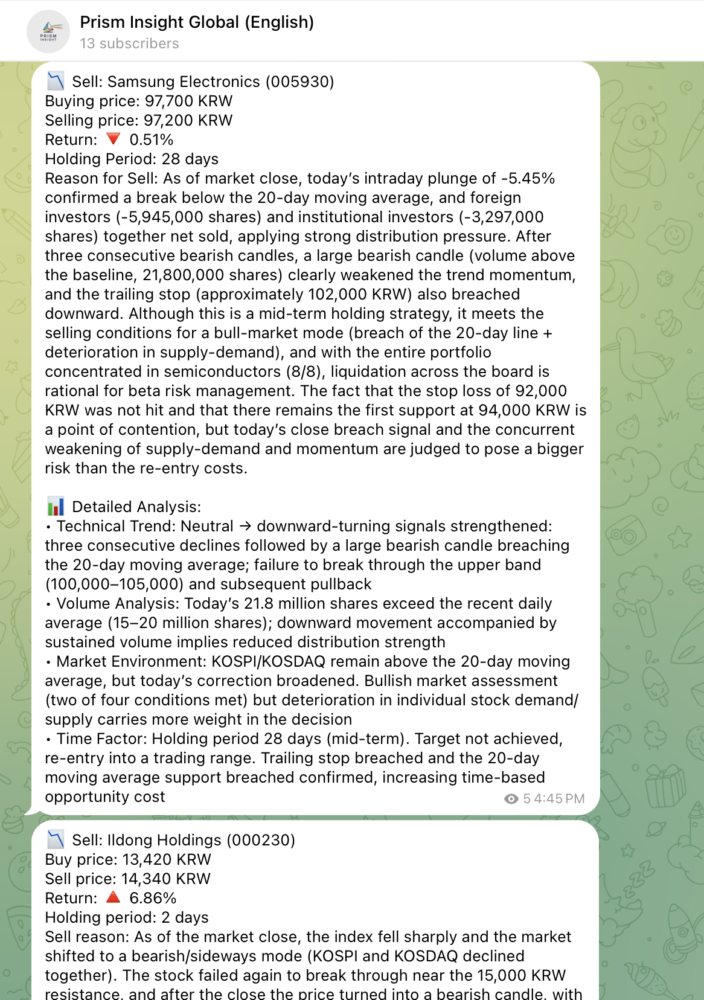
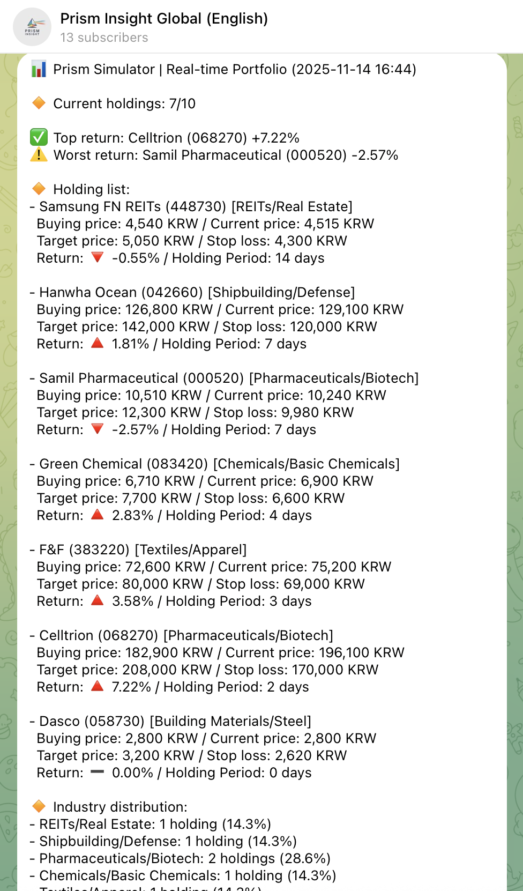
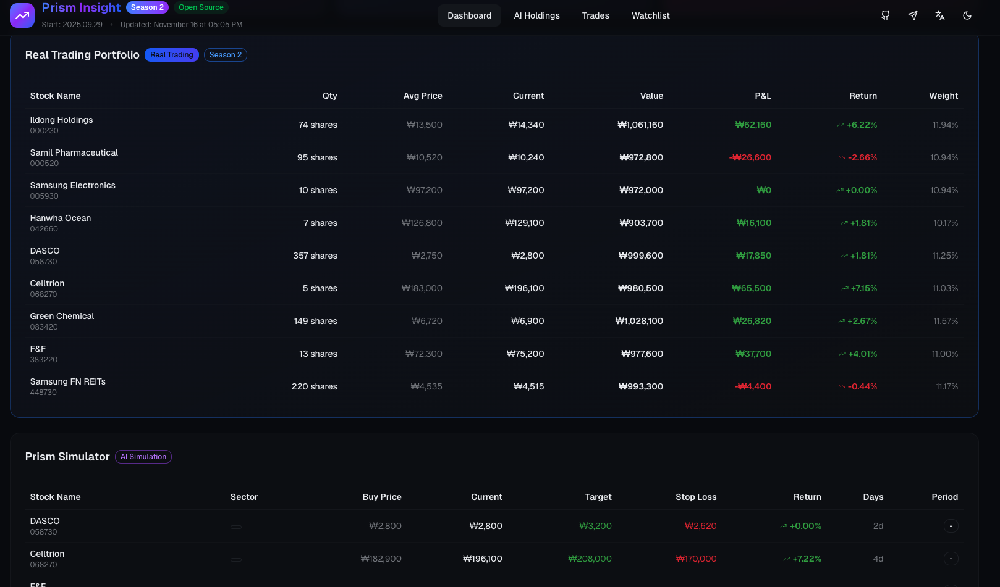
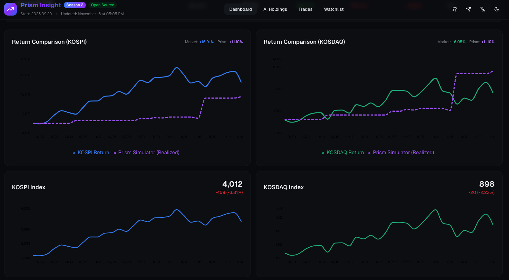
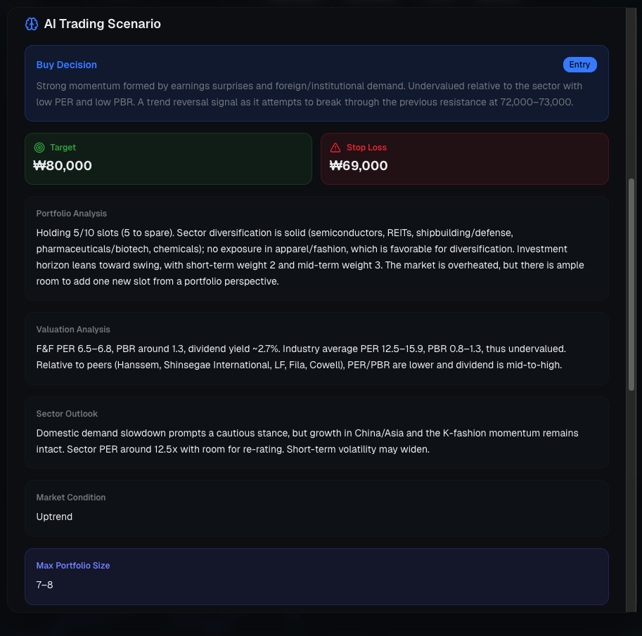
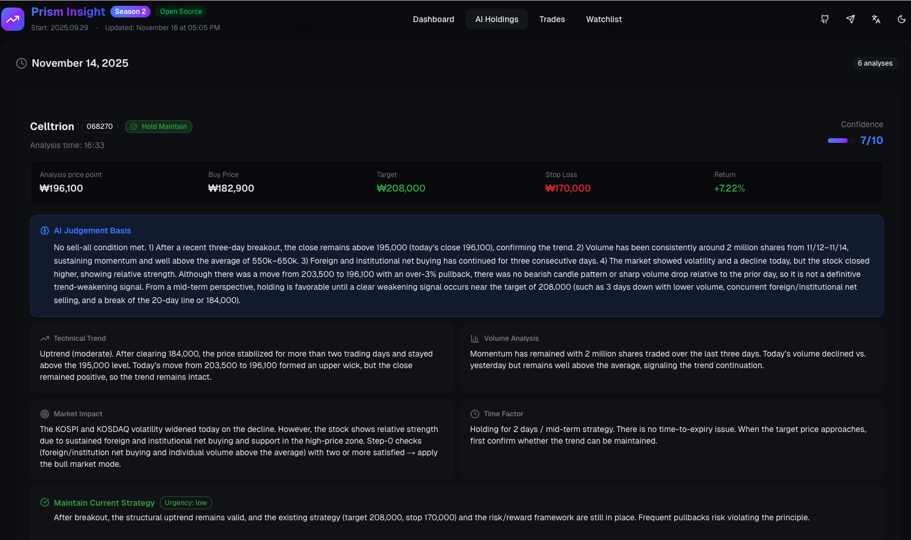
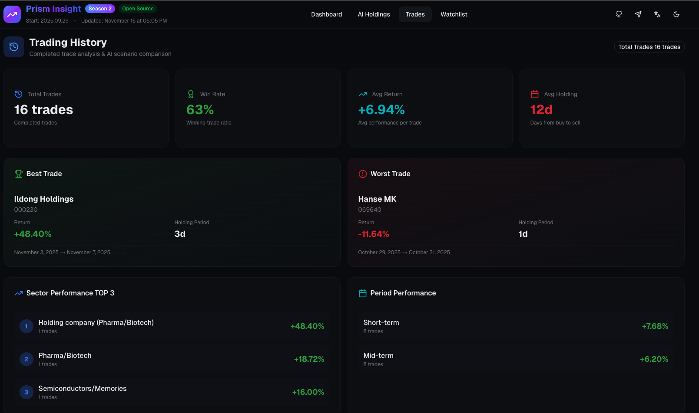
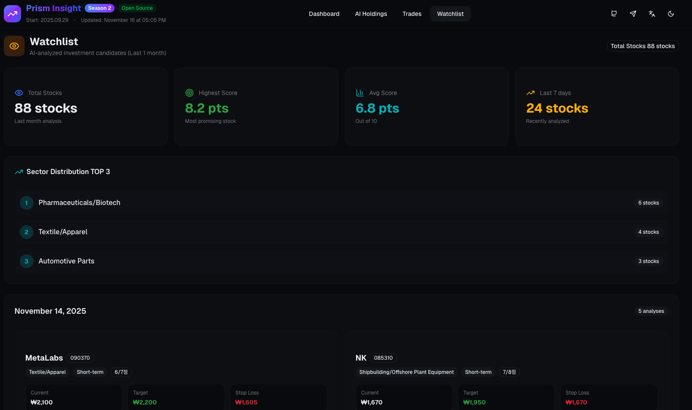

<div style="display: flex; justify-content: center; align-items: center; flex-direction: column;">
  

  <div style="text-align: center;">
    
    
    
    
    
  </div>
</div>

# 🔍 PRISM-INSIGHT

[](https://github.com/sponsors/dragon1086)
[](https://github.com/dragon1086/prism-insight/stargazers)

> 📖 [한국어 문서](README_ko.md)

AI-Powered Korean Stock Market Analysis and Trading System
- **[Official Telegram Channel](https://t.me/stock_ai_agent)**: Surge stock detection / Stock analysis report download / Trading simulation / Auto-trading reports (https://t.me/stock_ai_agent)
- **[Official Dashboard](https://analysis.stocksimulation.kr/)**: PRISM-INSIGHT real trading & simulation real-time performance dashboard (additionally provides AI portfolio analysis, trading history, watchlist)
- **Community**: Not available yet. Temporary discussions available in Telegram channel

## 📖 Project Overview

PRISM-INSIGHT is a **completely open-source free project** specializing in **Korean stock market (KOSPI/KOSDAQ) analysis** through **comprehensive AI analysis agents**. It automatically detects surging Korean stocks daily through a Telegram channel, generates expert-level analyst reports, and performs trading simulations and automated trading.

**✨ All features are provided 100% free!**

## 📈 Trading Simulator and Real Account Performance as of '25.11.17
### ⭐ Season 1 (Ended '25.09.28. No real account trading)
**Simulator Performance**
- Start Date: 2025.03.15
- Total Trades: 51
- Profitable Trades: 23
- Loss Trades: 28
- Win Rate: 45.1%
- **Cumulative Return: 408.60%**
- **[Trading Performance Summary Dashboard](https://claude.ai/public/artifacts/d546cc2e-9d2c-4787-8415-86930494e198)**

### ⭐⭐ Season 2 (In Progress)
**Simulator Performance**
- Start Date: 2025.09.29
- Total Trades: 16
- Profitable Trades: 10
- Loss Trades: 6
- Win Rate: 62.50%
- **Total Cumulative Return from Sold Stocks: 110.99%**
- **Realized Portfolio Return: 11.10%** (managed across 10 slots, 110.99% ÷ 10)
- Market Benchmark (from Season 2 start): KOSPI +16.91%, KOSDAQ +6.05%
- **[Trading Performance Summary Dashboard](https://analysis.stocksimulation.kr/)**

**Real Account Performance**
- Start Date: 2025.09.29
- Initial Capital: ₩9,969,801
- Current Total Assets (Valuation + Cash): ₩10,901,561
- **Return: +9.35%**

## 🤖 AI Agent System Architecture (Core Feature)

PRISM-INSIGHT is a **multi-agent system where 13 specialized AI agents collaborate**. Each agent specializes in a specific analysis domain and works organically together to deliver expert-level comprehensive analysis and trading.

### 📊 Analysis Team (6 Agents) - GPT-4.1 Based

#### 1. Technical Analyst


- **Role**: Stock price and trading volume technical analysis expert
- **Analysis Items**:
  - Price trends, moving averages, support/resistance levels
  - Chart patterns and technical indicators (RSI, MACD, Bollinger Bands)
  - Technical perspective

#### 2. Trading Flow Analyst


- **Role**: Investor trading trend analysis expert
- **Analysis Items**:
  - Trading patterns of institutional/foreign/individual investors
  - Investor group trends through volume analysis

#### 3. Financial Analyst


- **Role**: Corporate finance and valuation analysis expert
- **Analysis Items**:
  - Financial statement analysis (revenue, operating profit, net income)
  - Valuation assessment (PER, PBR, ROE, etc.)
  - Target price and securities firm consensus

#### 4. Industry Analyst


- **Role**: Corporate business structure and competitiveness analysis expert
- **Analysis Items**:
  - Business portfolio and market share
  - Strengths/weaknesses compared to competitors
  - R&D investment and growth drivers

#### 5. Information Analyst


- **Role**: News and issue trend analysis expert
- **Analysis Items**:
  - Identifying causes of same-day stock price fluctuations
  - Latest news and disclosure analysis
  - Industry trends and political/economic issues

#### 6. Market Analyst


- **Role**: Overall market and macroeconomic analysis expert
- **Analysis Items**:
  - KOSPI/KOSDAQ index analysis
  - Macroeconomic indicators (interest rates, exchange rates, prices)
  - Correlation between global economy and Korean market

---

### 💡 Strategy Team (1 Agent) - GPT-4.1 Based

#### 7. Investment Strategist


- **Role**: Integrates all analysis results to establish final investment strategy
- **Provides**:
  - Customized strategies for short/medium/long-term investors
  - Risk level and trading timing suggestions
  - Comprehensive opinion from portfolio perspective

---

### 💬 Communication Team (3 Agents) - GPT-4.1 / GPT-5-nano

#### 8-1. Summary Specialist


- **Role**: Converts detailed reports into core summaries for investors
- **Features**:
  - Generates concise Telegram messages within 400 characters
  - Extracts key information and investment points
  - Telegram-optimized formatting

#### 8-2. Quality Inspector


- **Role**: Evaluates quality of generated messages and suggests improvements
- **Features**:
  - Verifies accuracy, clarity, and format compliance
  - Detects hallucinations and identifies errors
  - Collaborates with Summary Specialist for iterative improvement to EXCELLENT rating

#### 8-3. Translation Specialist


- **Role**: Translates analysis reports and messages to multiple languages
- **Features**:
  - Supports multi-language broadcasting (English, Japanese, Chinese, etc.)
  - Preserves technical terminology and market context
  - Enables parallel transmission to language-specific Telegram channels

---

### 📈 Trading Simulation Team (2 Agents) - GPT-5 Based

#### 9-1. Buy Specialist


- **Role**: Buy decision-making and entry management based on AI reports
- **Features**:
  - Evaluates buy score based on valuation and momentum (1-10 points)
  - Manages portfolio with maximum 10 slots
  - Industry diversification and risk management
  - Dynamic target/stop-loss setting
  - Detailed trading scenario creation

#### 9-2. Sell Specialist


- **Role**: Monitors holdings based on trading scenarios and determines sell timing
- **Features**:
  - Real-time monitoring of stop-loss/profit-taking scenarios
  - Technical trend and market environment analysis
  - Portfolio optimization adjustment suggestions
  - Prudent decisions considering 100% exit characteristics

---

### 💬 User Consultation Team (2 Agents) - Claude Sonnet 4.5 Based

#### 10-1. Portfolio Consultant


- **Role**: User portfolio evaluation and customized investment advice
- **Features**:
  - Analysis based on user's average purchase price and holding period
  - Comprehensive evaluation using latest market data and news
  - Adaptive responses to user request styles (friendly/expert/direct, etc.)
  - Customized advice for profit/loss positions

#### 10-2. Dialogue Manager


- **Role**: Maintains conversation context and handles follow-up questions
- **Features**:
  - Remembers and references previous conversation context
  - Consistent answers to additional questions
  - Additional data lookup when necessary
  - Maintains natural conversation flow

---

## 🔄 Agent Collaboration Workflow

  

## 🎯 Key Features

- **🤖 AI Comprehensive Analysis (Core)**: Expert-level stock analysis through GPT-4.1 based multi-agent system
  [](https://youtu.be/4WNtaaZug74)

- **📊 Automatic Surge Stock Detection**: Watchlist selection through hourly (morning/afternoon) market trend analysis
  

- **📱 Automatic Telegram Transmission**: Real-time transmission of analysis results to Telegram channel
  

- **📈 Trading Simulation**: Investment strategy simulation using GPT-5 based generated reports
  
  
  

- **💱 Automated Trading**: Automatic trading according to trading simulation results through Korea Investment & Securities API

- **🎨 Realtime Dashboard**: We transparently disclose all information on the AI-traded portfolio, its performance relative to the market, the AI’s trading rationale, full trading history, watchlist, and system maintenance costs.
  
  
  
  
  
  
  

## 🧠 AI Model Usage

- **Core Analysis**: OpenAI GPT-4.1 (Comprehensive stock analysis agent)
- **Trading Simulation**: OpenAI GPT-5 (Investment strategy simulation)
- **Telegram Conversation**: Anthropic Claude Sonnet 4.5 (Bot interaction)
- **Translation**: OpenAI GPT-5-NANO (Multilingual broadcasting on a Telegram channel)

## 💡 MCP Servers Used

- **[kospi_kosdaq](https://github.com/dragon1086/kospi-kosdaq-stock-server)**: MCP server for KRX (Korea Exchange) stock data in report generation
- **[firecrawl](https://github.com/mendableai/firecrawl-mcp-server)**: Web crawling specialized MCP server for report generation
- **[perplexity](https://github.com/perplexityai/modelcontextprotocol/tree/main)**: Web search specialized MCP server for report generation
- **[sqlite](https://github.com/modelcontextprotocol/servers-archived/tree/HEAD/src/sqlite)**: MCP server specialized in internal DB storage for trading simulation records
- **[time](https://github.com/modelcontextprotocol/servers/tree/main/src/time)**: MCP server for current time retrieval

## 🚀 Getting Started

### Prerequisites

- Python 3.10+
- OpenAI API Key (GPT-4.1, GPT-5)
- Anthropic API Key (Claude-Sonnet-4.5)
- Telegram Bot Token and Channel ID
- Playwright (for PDF conversion)
- Korea Investment & Securities API app key and secret key

### Installation

1. **Clone Repository**
```bash
git clone https://github.com/dragon1086/prism-insight.git
cd prism-insight
```

2. **Install Dependencies**
```bash
pip install -r requirements.txt
```

3. **Prepare Configuration Files**
Copy the example files to create actual configuration files:
```bash
cp .env.example .env
cp ./examples/streamlit/config.py.example ./examples/streamlit/config.py
cp mcp_agent.config.yaml.example mcp_agent.config.yaml
cp mcp_agent.secrets.yaml.example mcp_agent.secrets.yaml
```

4. **Edit Configuration Files**
Edit the copied configuration files to enter necessary API keys and settings.

5. **Install Playwright** (for PDF conversion)

The system will **automatically install** Playwright browser on first run. For manual installation:

```bash
# Install Playwright package (included in requirements.txt)
pip install playwright

# Download Chromium browser
python3 -m playwright install chromium
```

**Platform-specific installation:**

```bash
# macOS
pip3 install playwright
python3 -m playwright install chromium

# Ubuntu/Debian
pip install playwright
python3 -m playwright install --with-deps chromium

# Rocky Linux 8 / CentOS / RHEL
pip3 install playwright
python3 -m playwright install --with-deps chromium

# Or use the installation script
cd utils
chmod +x setup_playwright.sh
./setup_playwright.sh
```

**📖 For detailed installation instructions, see:** [utils/PLAYWRIGHT_SETUP.md](utils/PLAYWRIGHT_SETUP.md)

6. **Install perplexity-ask MCP Server**
```bash
cd perplexity-ask
npm install
```

7. **Install Korean Fonts** (Linux environment)

Korean fonts are required for Korean text display in charts on Linux.

```bash
# Rocky Linux 8 / CentOS / RHEL
sudo dnf install google-nanum-fonts

# Ubuntu 22.04+ / Debian
Run ./cores/ubuntu_font_installer.py

# Refresh font cache
sudo fc-cache -fv
python3 -c "import matplotlib.font_manager as fm; fm.fontManager.rebuild()"

Note: macOS and Windows have default Korean font support, no installation needed
```

8. **Auto-run Setup (Crontab)**

Set up crontab to run automatically:

```bash
# Simple setup (recommended)
chmod +x utils/setup_crontab_simple.sh
utils/setup_crontab_simple.sh

# Or advanced setup
chmod +x utils/setup_crontab.sh
utils/setup_crontab.sh
```

See [CRONTAB_SETUP.md](utils/CRONTAB_SETUP.md) for details.

### Required Configuration Files

The following configuration files must be set up to run the project:

#### 🔧 Core Settings (Required)
- **`mcp_agent.config.yaml`**: MCP agent configuration
- **`mcp_agent.secrets.yaml`**: MCP agent secret information (API keys, etc.)

#### 📱 Telegram Settings (Optional)
- **`.env`**: Environment variables including Telegram channel ID, bot token, etc.
  - Use `--no-telegram` option to run without Telegram
  - All analysis features work normally without Telegram

#### 🌐 Web Interface Settings (Optional)
- **`./examples/streamlit/config.py`**: Report generation web settings

💡 **Tip**: Use `--no-telegram` option to run without `.env` file!

## 📋 Usage

### Basic Execution

Run the entire pipeline to automate from surge stock analysis to Telegram transmission:

```bash
# Run both morning + afternoon (Telegram enabled)
python stock_analysis_orchestrator.py --mode both

# Morning only
python stock_analysis_orchestrator.py --mode morning

# Afternoon only
python stock_analysis_orchestrator.py --mode afternoon

# Local test without Telegram (no Telegram setup needed)
python stock_analysis_orchestrator.py --mode morning --no-telegram

# Generate English reports (default: Korean)
python stock_analysis_orchestrator.py --mode morning --language en

# Broadcast to multiple language channels (requires setup in .env)
python stock_analysis_orchestrator.py --mode morning --broadcast-languages en,ja,zh
```

#### 💡 Telegram Option (`--no-telegram`)

You can run the system without Telegram setup:

**Usage Scenarios:**
- 🧪 **Local Development/Testing**: Quickly test core features without Telegram setup
- 🚀 **Performance Optimization**: Skip message generation and transmission process
- 🔧 **Debugging**: Focus only on analysis and report generation features

**Execution Effects:**
- ✅ Surge stock detection → Report generation → PDF conversion → Tracking system (all working normally)
- ❌ Telegram alerts, message generation, message transmission (skipped)
- 💰 AI summary generation cost savings

**Required Environment Variables (when using Telegram):**
```bash
# .env file
TELEGRAM_CHANNEL_ID="-1001234567890"  # Main channel (Korean by default)
TELEGRAM_BOT_TOKEN="1234567890:ABCdefGHIjklMNOpqrsTUVwxyz"

# Multi-language broadcasting (optional)
# Use with --broadcast-languages argument (e.g., --broadcast-languages en,ja,zh)
# TELEGRAM_CHANNEL_ID_EN="-1001234567891"  # English channel
# TELEGRAM_CHANNEL_ID_JA="-1001234567892"  # Japanese channel
# TELEGRAM_CHANNEL_ID_ZH="-1001234567893"  # Chinese channel
```

### Individual Module Execution

**1. Run Surge Stock Detection Only**
```bash
python trigger_batch.py morning INFO --output trigger_results.json
```

**2. Generate AI Analysis Report for Specific Stock (Core Feature)**
```bash
python cores/main.py
# Or use analyze_stock function directly
```

**3. PDF Conversion**
```bash
python pdf_converter.py input.md output.pdf
```

**4. Generate and Send Telegram Messages**
```bash
python telegram_summary_agent.py
python telegram_bot_agent.py
```

## 📁 Project Structure

```
prism-insight/
├── 📂 cores/                     # 🤖 Core AI Analysis Engine
│   ├── 📂 agents/               # AI Agent Modules
│   │   ├── company_info_agents.py        # Company Information Analysis Agent
│   │   ├── news_strategy_agents.py       # News and Investment Strategy Agent
│   │   ├── stock_price_agents.py         # Stock Price and Volume Analysis Agent
│   │   ├── telegram_quality_inspector.py # Quality Inspector Agent
│   │   ├── telegram_summary_agent.py     # Summary Specialist Agent
│   │   └── telegram_translator_agent.py  # Translation Specialist Agent
│   ├── analysis.py              # Comprehensive Stock Analysis (Core)
│   ├── main.py                  # Main Analysis Execution
│   ├── report_generation.py     # Report Generation
│   ├── stock_chart.py           # Chart Generation
│   └── utils.py                 # Utility Functions
├── 📂 examples/streamlit/        # Web Interface
├── 📂 trading/                   # 💱 Automated Trading System (Korea Investment & Securities API)
│   ├── kis_auth.py              # KIS API Authentication and Token Management
│   ├── domestic_stock_trading.py # Domestic Stock Trading Core Module
│   ├── portfolio_telegram_reporter.py # Portfolio Telegram Reporter
│   ├── 📂 config/               # Configuration File Directory
│   │   ├── kis_devlp.yaml       # KIS API Configuration (app key, account number, etc.)
│   │   └── kis_devlp.yaml.example # Configuration File Example
│   └── 📂 samples/              # API Sample Code
├── 📂 utils/                     # Utility Scripts
├── 📂 tests/                     # Test Code
├── stock_analysis_orchestrator.py # 🎯 Main Orchestrator
├── telegram_config.py           # Telegram Configuration Management Class
├── trigger_batch.py             # Surge Stock Detection Batch
├── telegram_bot_agent.py        # Telegram Bot (Claude Based)
├── stock_tracking_agent.py      # Trading Simulation (GPT-5)
├── stock_tracking_enhanced_agent.py # Enhanced Trading Simulation
├── pdf_converter.py             # PDF Conversion
├── requirements.txt             # Dependency List
├── .env.example                 # Environment Variable Example
├── mcp_agent.config.yaml.example    # MCP Agent Configuration Example
├── mcp_agent.secrets.yaml.example   # MCP Agent Secret Example
```

## 📈 Analysis Report Composition

The comprehensive analyst report generated by AI agents consists of the following sections:

1. **📊 Key Investment Points** - Summary and main points
2. **📈 Technical Analysis**
   - Stock price and trading volume analysis
   - Investor trading trend analysis
3. **🏢 Fundamental Analysis**
   - Company status analysis
   - Company overview analysis
4. **📰 News Trend Analysis** - Recent major news and issues
5. **🌐 Market Analysis** - KOSPI/KOSDAQ index and macro-environment analysis
6. **💡 Investment Strategy and Opinion** - Strategies for different investor types

## 🔧 Customization

### Modify Surge Stock Detection Criteria
In `trigger_batch.py`, you can modify:
- Trading volume increase threshold
- Stock price increase criteria
- Market capitalization filtering conditions

### Modify AI Prompts
You can customize analysis instructions in each agent file in the `cores/agents/` directory.

### Change Chart Style
You can modify chart colors, styles, and indicators in `cores/stock_chart.py`.

## 🤝 Contributing

1. Fork the project
2. Create a feature branch (`git checkout -b feature/amazing-feature`)
3. Commit your changes (`git commit -m 'Add amazing feature'`)
4. Push to the branch (`git push origin feature/amazing-feature`)
5. Create a Pull Request

## 📄 License

This project is distributed under the MIT License. See the `LICENSE` file for details.

## ⚠️ Disclaimer

The analysis information provided by this system is for investment reference purposes only and is not intended as investment advice. All investment decisions and resulting profits/losses are the responsibility of the investor.

## 📞 Contact

For project inquiries or bug reports, please submit through [GitHub Issues](https://github.com/dragon1086/prism-insight/issues).

## 💝 Sponsorship for Project Sustainability

### 🥇 Seeking Gold Sponsor (1 spot only, now recruiting)

**Help PRISM-INSIGHT run permanently for $500/month.**

✨ **Gold Sponsor Exclusive Benefits:**
- 🏆 **Exclusive Exposure**: Logo placed exclusively at the top of GitHub README + [Dashboard](https://analysis.stocksimulation.kr/) main
- 📊 **User Reach**: Continuous brand exposure to 450+ Telegram subscribers + daily growing GitHub visitors
- 💎 **Honor**: The only official sponsorship partner of a completely open-source AI stock analysis system
- 🛡️ **Stability Guarantee**: Provide an environment where a developer short on time due to parenting can focus on system maintenance
- 🤝 **Direct Communication**: Opportunity to provide input on project roadmap and priorities

---
**$500/month Details**

1. AI Operation Cost Coverage: Full API cost for premium AI models like GPT-5
2. Stabilization Compensation: Compensation for emergency maintenance and stabilization work on core systems
---

📧 **Gold Sponsor Partnership Inquiry**:
- **Email**: dragon1086@naver.com
- **GitHub Issues**: [Partnership Inquiry](https://github.com/dragon1086/prism-insight/issues/new?labels=sponsorship&template=partnership.md)
- **Telegram**: @stock_ai_ko
- Or select $500 tier on [GitHub Sponsors](https://github.com/sponsors/dragon1086)

> 💡 **Need a customized proposal for your company?** Contact us via email for consultation first.

---

### 💙 To Individual Sponsors

Even small support gives great strength! Support the project with the cost of a cup of coffee.

<div align="center">
  <a href="https://github.com/sponsors/dragon1086">
    
  </a>
</div>

### 💰 Transparent Operations

Monthly costs of approximately ₩260,000 for API and server expenses (as of October '25):
- OpenAI API (GPT-4.1, GPT-5): ~₩140,000/month
- Anthropic API (Claude Sonnet 4.5): ~₩30,000/month
- Firecrawl API (MCP Server): ~₩30,000/month
- Perplexity API (MCP Server): ~₩15,000/month
- Server and Infrastructure: ~₩45,000/month

Currently used by 450 people for free.

### ✨ Current Sponsorship Status

Thank you so much! PRISM-INSIGHT continues to operate with your support.

#### 🥇 Gold Sponsor
<!-- gold-sponsor -->
**Spot available!** Be our first partner.
<!-- gold-sponsor -->

#### 💙 Individual Sponsors
<!-- sponsors -->
**Core Supporter**
- [@tehryung-ray](https://github.com/tehryung-ray) 💙
<!-- sponsors -->

---

**Important:** All features are provided free regardless of sponsorship.
Sponsorship is just support for service continuity.

---

## ⭐ Project Growth

Achieved **250+ Stars in just 10 weeks** since mid-August '25 launch!

[](https://star-history.com/#dragon1086/prism-insight&Date)

---

**⭐ If this project helped you, please give us a Star!**
